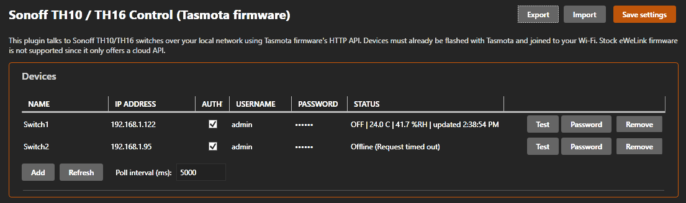

# Sonoff TH10/TH16 Control - SimHub Plugin

Controls Sonoff TH10/TH16 wifi smart switches and exposes their temperature/humidity
sensor readings as SimHub properties, so they can drive dashboards, macros, or be
combined with any other SimHub data.

## Important: firmware requirement

Stock Sonoff / eWeLink firmware only exposes a **cloud** API (OAuth2 login via the
eWeLink app/servers); it has no supported local HTTP API suitable for a desktop plugin.
This plugin instead talks to the switch's **local network** API, which means your
TH10/TH16 units need to be flashed with **Tasmota** firmware first. This is the standard,
well documented approach used by most home-automation integrations for these devices
(Home Assistant, openHAB, Node-RED, etc. all do the same thing).

Flashing Tasmota (briefly):
1. Search for "Tasmota Sonoff TH flashing" for the current tuya-convert / serial flashing
   guide, since exact steps depend on your device's hardware revision.
2. Once flashed, connect the TH10/TH16 to your Wi-Fi through Tasmota's captive setup portal.
3. If you have an AM2301, SI7021, DS18B20, or SHT3x sensor wired to the terminal (this is
   what the "TH" in TH10/TH16 is for), configure it under Tasmota's Configure Other /
   Module page so temperature/humidity show up in its status JSON.
4. Note the device's IP address (set a DHCP reservation on your router so it doesn't change).

If you'd rather not flash third-party firmware, this plugin will not be able to control
the device: that's a firmware/API limitation, not a plugin setting.

## Building

1. Install SimHub (this is where the plugin SDK assemblies come from - they are not on NuGet).
2. Open `SimHub.Plugin.SonoffSwitch.slnx` in Visual Studio 2022 (any edition with the
   ".NET desktop development" workload, for WPF support).
3. If SimHub is not installed at the default `C:\Program Files (x86)\SimHub`, either:
   - Right-click the project -> Properties -> and set the `SimHubInstallPath` MSBuild
     property to your install folder, or
   - Copy `SimHub.Plugins.dll`, `GameReaderCommon.dll`, and `log4net.dll` from your
     SimHub folder into `SimHub.Plugin.SonoffSwitch\lib\` and switch the `<HintPath>` entries in
     the .csproj to point there instead (see `lib\README.txt`).
4. Build. The project's `CopyToSimHub` target automatically copies the built DLL (and
   Newtonsoft.Json.dll) into your SimHub folder after a successful build.
5. Start (or restart) SimHub, then check its plugin list and enable "Sonoff TH10/TH16
   Control" if it's not enabled automatically.

## Using the plugin

Open the plugin's settings page in SimHub (left menu -> Sonoff TH10/TH16) and:
1. Click **Add device**, then fill in a unique **Name** and the device's **IP address**.
2. If you set a web admin username/password in Tasmota, tick **Auth?**, fill in the username,
   and use the row's **Password** button to enter the password in its own dialog.
3. Click **Save settings**. The plugin immediately starts polling the device.
4. Use that row's **Test** button to trigger one poll right away and confirm connectivity.

## Import / Export

The **Export** and **Import** buttons (top right of the settings page) save/load the
device list and poll interval as a JSON file. Passwords are never written to an export
file, so after importing a configuration, re-enter the password for any device that has
**Auth?** ticked.

For each device named e.g. `Garage`, this plugin exposes:

| Property                     | Type     | Meaning                                    |
|-------------------------------|----------|---------------------------------------------|
| `Garage.Online`               | bool     | Last poll succeeded                         |
| `Garage.PowerOn`               | bool     | Relay is currently on                       |
| `Garage.Temperature`          | double   | Degrees Celsius (null if no sensor wired)   |
| `Garage.Humidity`             | double   | Relative humidity % (null if no sensor)     |
| `Garage.LastUpdate`           | DateTime | Local time of the last successful poll      |

These show up under this plugin's name in SimHub's property list/dash editor, and can be
used anywhere SimHub properties are used (dashboards, overlays, conditions, etc).

It also registers three controller/keyboard-bindable **actions** per device:
`Garage.TurnOn`, `Garage.TurnOff`, `Garage.Toggle` - bind these in SimHub's Controllers
or Keyboard settings the same way as any other SimHub action.

## Known limitations

- Renaming a device changes its property/action names going forward, but SimHub's SDK
  has no way to detach previously registered delegates, so the old names remain visible
  (inert) until SimHub is restarted. Removing a device has the same limitation.
- Only one sensor's Temperature/Humidity fields are read per device (the first one Tasmota
  reports), which covers the standard single-sensor TH10/TH16 wiring.
- Basic auth is sent in cleartext HTTP; this is only intended for trusted home LANs.
